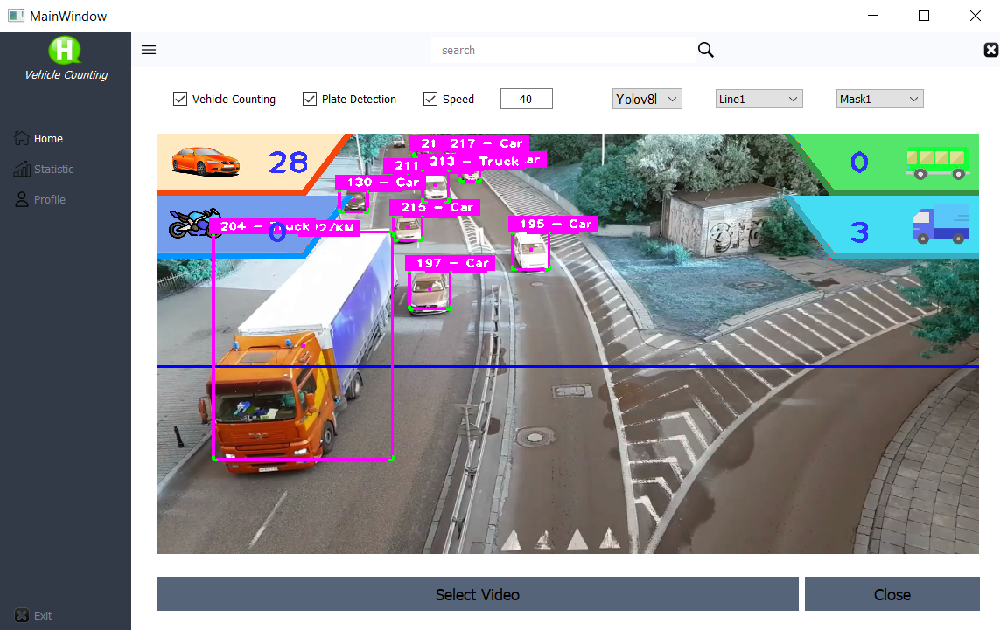
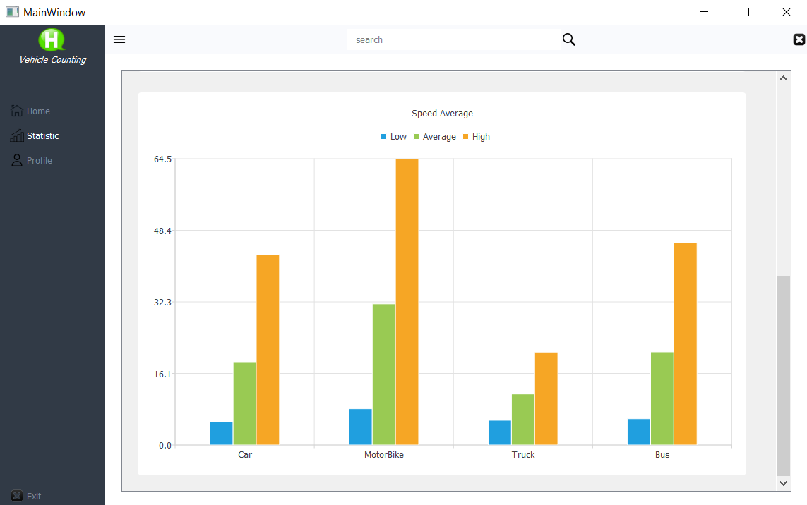

# Vehicle Detection and Counting with YOLOv8 and PyQt5 GUI

This project utilizes PyQt5, YOLOv8, and TensorFlow to create an artificial intelligence system capable of detecting and identifying vehicles, including cars, motorcycles, trucks, and buses. Additionally, the system can detect vehicle speed and issue fines for vehicles exceeding speed limits.

The system works by monitoring traffic through a camera, with images being analyzed using the YOLOv8 model to identify vehicle type, license plate information, and speed. This data can then be processed and used in a fine issuance system.

The project features a user-friendly interface built using PyQt5, allowing users to set vehicle speed limits, initiate and stop license plate reading processes, and view vehicle type counts.

This project is significant for enhancing traffic discipline through automated issuance of traffic fines and providing a human-free method for monitoring traffic.

|  |  |
|:---:|:---:|
| Main Page 1 | Main Page 2 |

|  |  | |
|:---:|:---:|:---:|
| Profile Page | Statistic Page 1 | Statistic Page 2 |

## Installation

To run this project, you must first have Python and pip installed on your computer.

To download this project, you can use the `git clone` command as follows:

```
git clone https://github.com/HasancanCakicioglu/VehicleDetectCounting-PyQt5_GUI-Yolov8.git
```

After downloading the project files, you can install the required libraries by running the following command:
```
pip install -r requirements.txt
```

## Run
After downloading the project files and installing the required libraries, you can start the GUI by running the following command:
```
python main.py
```


## CUDA Installation  

This project requires CUDA for efficient and faster performance. CUDA is a parallel computing platform developed by NVIDIA that significantly improves performance in AI projects.

Failure to install CUDA can lead to slow performance and related issues. CUDA installations may vary depending on the operating system and hardware used. Installing the correct drivers is essential.

Proper configuration of the CUDA installations is crucial for the project's efficient and effective performance. Resources such as NVIDIA's official website, forums, and tutorials may be useful for installation and configuration.

To achieve efficient and faster performance, it is recommended to install CUDA for this project.

## Artificial Intelligence Models Used

* Yolov8
* Tensorflow
* EasyOCR

This project employs three different Artificial Intelligence models for various tasks:

YOLOv8 Vehicle Detection: This model is used to detect different types of vehicles in real-time, including cars, motorcycles, trucks, and buses.

Plate Detection using TensorFlow: This model is utilized to detect license plates from the images of the vehicles.

Plate Text Recognition using EasyOCR: Once the license plates are detected, this model reads and extracts the text from them using EasyOCR, an optical character recognition (OCR) tool.

Using these three models together allows for more comprehensive analysis and understanding of the vehicles in the input images or videos.


